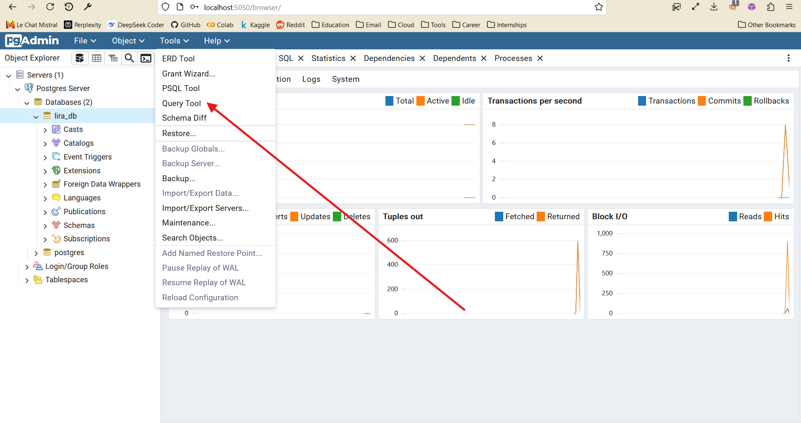

# Отчёт по финальному проекту “Создание системы управления данными для автоматизации работы бюро проката музыкальных инструментов”

## Пахолков Виктор

### Выбор предметной области

Для выполнения итогового проекта в рамках аттестации по направлению “Технологии анализа данных” мною была выбрана задача “Проектирование и создание базы данных на основе некоторого набора данных”. 
Я выбрал из списка предложенных предметных областей автоматизировать работу бюро проката музыкальных инструментов “Лира”:

[“Вам предстоит автоматизировать работу бюро проката музыкальных инструментов “Лира”. Бюро проката - это контора, которая сдает инструменты нескольких видов в аренду. Каждый инструмент имеет свой  идентификационный номер, время, через которое нужно проводить  очередную инспекцию его состояния и стоимость его проката на день.  Бюро хранит информацию о своих клиентах, а именно ФИО, адрес и  телефон. Выдача инструментов в прокат фиксируется в журнале. Оплата за аренду взимается при выдаче инструмента, регулярно производится проверка просроченности аренды.”](https://dc-edu.itmo.ru/assets/courseware/v1/696a103b8141179c922d73c36dcfa5cc/asset-v1:ITMO+bonus_track_tech+2023+type@asset+block/S_A_Examples.doc)

Запросы для проектируемой базы данных я брал из этого же [документа](https://dc-edu.itmo.ru/assets/courseware/v1/696a103b8141179c922d73c36dcfa5cc/asset-v1:ITMO+bonus_track_tech+2023+type@asset+block/S_A_Examples.doc):

1. Имена клиентов вместе с описанием инструментов, которые они брали на прокат, и даты заказов

2. Инструменты, которые пора проверить

3. Все отданные барабаны

4. Все инструменты с дневной стоимостью проката между 10 и 20

5. Вся информация об инструментах, которые когда-либо брали на прокат

6. Вся информация о клиентах, которые ещё не вернули инструменты

7. Не отданные в прокат инструменты

8. Сумма заказов для каждого клиента

9. Средняя выручка по каждому инструменту

10. Сколько раз каждый инструмент брали на прокат

### ER-диаграмма и описание архитектуры


Мною выбрана архитектура СУБД, представленная на fig.1 в виде ER-диаграммы.

Данные в БД хранятся в трёх таблицах – INSTRUMENTS, CLIENTS и RENT.

Таблица INSTRUMENTS включает в себя поле “instrument_id” которое является primary key этой таблицы в числовом формате, описание типа инструмента “instrument_type” в текстовом формате, цену за аренду на день в поле “price_per_day” в числовом формате, а также дату последней проверки в поле “last_inspection” и количество дней между проверками в поле “days_between_inspections”. 

Таблица CLIENTS хранит данные о клиентах – их уникальный ID, являющийся primary key, имя, адрес и номер телефона.

Таблица RENT хранит информацию о договорах аренды и содержит два foreign keys - “instrument_id” и “client_id”, связывающих её с таблицами INSTRUMENTS и CLIENTS соответственно. Кроме того она содержит информацию о провозглашённом клиентом сроке аренды, дате начала аренды, просрочил ли клиент провозглашённый срок и на сколько дней.

В области ограничений, наложенных на поля таблицы, кроме типов данных и указания primary keys и references, можно также отметить NOT NULL значение полей “instrument_type”, “price_per_day”, “date_of_beginning”, “is_returned”. 

Для поля “date_of_beginning” указано дефолтное значение, записывающее в него текущую дату при оставлении этого поля пустым при добавлении строк.

### Выбор СУБД. Создание структуры хранения данных. Реализация запросов

Для реализации поставленной задачи была выбрана СУБД PostgreSQL, развёрнутая в Docker контейнере при помощи Docker Compose с панелью управления PGAdmin4.

PostgreSQL была выбрана из-за открытого исходного кода, надежности и распространённости в мире СУБД.

PGAdmin4 был выбран вследствие распространённости, удобства взаимодействия с postgres и удобства кофигурации.

Я решил применить Docker в рамках этого проекта по причине высокой надёжности, кросс-платформенности, а так же буквальной гарантии воспроизводства моих результатов. 
Написанный docker compose включает в себя развёртывание postgres и pgadmin на локальном сервере, создание базы данных по вышеописанной спецификации, а также наполнение этой базы синтетическими тестовыми данными. 
Проект целиком доступен на [облачном хранилище](https://drive.filen.io/f/7f091d8d-9ae6-49d8-8c1b-e85c4bd9f509#GsUjhurmqywalVHGaRN9kpA0n2CXFSrq) в виде архива “final-project-pakholkov-main.zip” или в этом репозитории на github.

При желании всё собрать и перепроверить самостоятельно (это очень просто, но требуется установленный на устройство [Docker Desktop](https://www.docker.com/products/docker-desktop/)). 
Для этого в следующем пункте приложена инструкция по запуску docker compose, подключения к базе данных и отправку запросов для перепроверки.

В случае если такого желания нет, мною предоставлены два SQL скрипта. 

Скрипт “create_populate.sql” отвечает за создание таблиц в рамках моей базы данных “lira_db” и наполнение их тестовыми синтетическими данными. 
Он доступен как в [хранилище](https://drive.filen.io/f/7f091d8d-9ae6-49d8-8c1b-e85c4bd9f509#GsUjhurmqywalVHGaRN9kpA0n2CXFSrq), так и в виде [файла опубликованного на github](https://github.com/victorpakholkov/final-project-pakholkov/blob/main/create_populate.sql). 
Скрипт последовательно создаёт три обозначенные таблицы и последовательно же наполняет их тестовыми данными.

Второй SQL скрипт - “queries.sql” содержит запросы к базе данных, позволяющие получить выборки данных, указанные в спецификации задания “Лира”. 
Над queries в виде комментариев указаны запросы, на которые каждая query должна отвечать. 
Проверяющий может обратить внимание, что некоторые запросы к базе данных получились достаточно объемными и неестественно длинными. 
Но хочу отметить, что целью этих queries был вывод макимально полной и всей полезной информации касательно каждого запроса. 
По этой причине в них содержится досаточно много конструкций по типу JOIN и UNION. При необходимости получения только части информации, queries сокращаются до более эффективных форм. 
В реальном производственном процессе такие queries имело бы смысл сохранить как либо как SQL stored procedure, либо через PGAdmin4 Query Tool. 
Этот скрипт так же доступен как в [хранилище](https://drive.filen.io/f/7f091d8d-9ae6-49d8-8c1b-e85c4bd9f509#GsUjhurmqywalVHGaRN9kpA0n2CXFSrq) под соответсвующим названием, так и в виде [файла опубликованного на github](https://github.com/victorpakholkov/final-project-pakholkov/blob/main/queries.sql).

Результаты исполнения этих queries в формате CSV доступны в [хранилище](https://drive.filen.io/f/7f091d8d-9ae6-49d8-8c1b-e85c4bd9f509#GsUjhurmqywalVHGaRN9kpA0n2CXFSrq) в папке “Results of queries in CSV format”.

### Инструкция к запуску моего Docker Compose на локальном устройстве: 

0) Для корректной работы этого docker сервиса рекомендуется иметь на устройстве или установить Docker Desktop. 
Обычный docker daemon, даже с установленным compose использовать не рекомендуется, особенно на UNIX-подобных системах, из-за опасности пересечения процессов с системными и вероятности, что необходимые для корректной работы порты будут заняты другими процессами. 
Инструкции по установке Docker Desktop на любую платформу доступны [здесь](https://docs.docker.com/desktop/).

1) Скачать архив “final-project-pakholkov-main.zip” из [хранилища](https://drive.filen.io/f/7f091d8d-9ae6-49d8-8c1b-e85c4bd9f509#GsUjhurmqywalVHGaRN9kpA0n2CXFSrq) или сделать git copy:

```
git clone https://github.com/victorpakholkov/final-project-pakholkov.git
```
а) Распаковать архив, если скачали его из хранилища

2) Через терминал сделать распакованный архив/директорию из git рабочей директорией 

```
cd {место_распаковки}/final-project-pakholkov-main
```

или

```
cd {место_распаковки}/final-project-pakholkov
```

3) Запустить docker compose командой в терминале

```
docker compose up -d
```

4) Подождать несколько минут

5) Открыть браузер и перейти на localhost:5050

6) В открывшемся окне pgadmin кликнуть на стрелку возле servers (fig. 2)


7) В открывшемся промпте “Connect to server” ввести qwerty123 и нажать OK (fig. 3)


8) Открыть меню Databases и выбрать lira_db (fig. 4)


9) Далее в панеле tools выбрать query tool (fig. 5)



10) Скопировать queries из файла queries.sql и проверить валидность возвращаемых результатов (fig. 6)


11) После проверки, из той же рабочей директории остановить docker compose

```
docker compose down
```

### Ссылки

Облачное хранилище: https://drive.filen.io/f/7f091d8d-9ae6-49d8-8c1b-e85c4bd9f509#GsUjhurmqywalVHGaRN9kpA0n2CXFSrq

Github проекта: https://github.com/victorpakholkov/final-project-pakholkov

Документ, откуда была взята предметная область и example queries: https://dc-edu.itmo.ru/assets/courseware/v1/696a103b8141179c922d73c36dcfa5cc/asset-v1:ITMO+bonus_track_tech+2023+type@asset+block/S_A_Examples.doc
